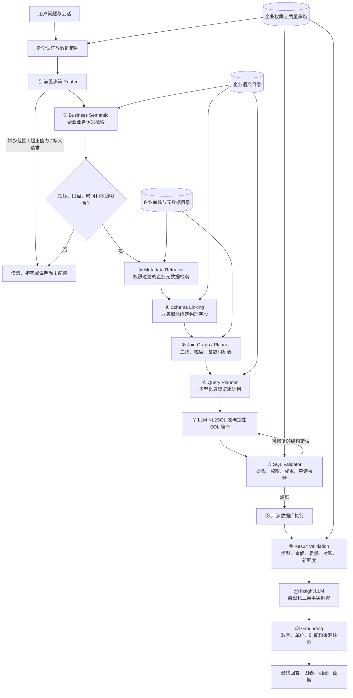

# InsightCopilot · 企业可信只读对话分析架构

InsightCopilot 是一个面向企业业务人员的可信对话分析架构：用户用自然语言提问，系统结合企业确认的业务语义、元数据和数据血缘，生成受约束的只读查询计划，返回带口径、来源和校验结果的业务解释。

本仓库的目标是展示一套可以交给企业或实施方的完整解决思路。它不假设所有企业的 SAP 版本、字段命名、指标口径、权限和数据治理方式相同，也不把模型猜测当成企业事实。

## 企业试点的边界

企业试点最终是一个**只读系统**。系统可以读取、聚合、比较、解释和导出已经授权的数据，但不执行任何业务写操作：

- 不过账、不清账、不反清账、不支付。
- 不修改客户、凭证、配置、权限或业务主数据。
- 不执行 `INSERT`、`UPDATE`、`DELETE`、`MERGE`、DDL 或写入型存储过程。
- 不通过 SQL、RFC、BAPI、OData 或外部函数回写源系统。
- 导出也必须重新经过行列权限和敏感字段检查。

只读不是页面上的提示，而是由应用接口、查询编译器、数据库账号、安全视图、网络边界和源端接口共同执行的系统约束。

## 完整工作流



每一阶段只能产生四种状态：`passed`、`needs_clarification`、`unsupported`、`blocked_by_policy`。上一阶段没有通过时，下一阶段不能把它当成有效上下文继续执行。

## 12 个阶段如何协作

| 阶段 | 平台做什么 | 企业必须提供或确认什么 |
|---|---|---|
| ① Router | 判断问题类型、候选业务域和缺失信息 | 业务域边界、组织简称、常见问题、禁止问题 |
| ② Business Semantic | 检索指标、术语、时间和币种口径 | 指标定义、同义词、公式、粒度、例外、负责人、版本 |
| ③ Metadata Retrieval | 从授权目录找表、视图、字段和血缘路径 | 元数据目录、字段说明、数据版本、更新时间、可信等级 |
| ④ Schema Linking | 将业务概念绑定到物理字段和代码值 | SAP版本、字段意义、代码字典、复合键、人工确认 |
| ⑤ Join Planner | 规划允许的关联路径，检查粒度和多对多风险 | 主外键、基数、桥表、有效期、允许/禁止路径 |
| ⑥ Query Planner | 生成指标、维度、筛选、时间和排序的逻辑计划 | 查询模板、指标可加性、比较规则、边界样例 |
| ⑦ SQL 编译/生成 | 将注册指标编译为方言 SQL，探索问题才允许受限生成 | 数据库方言、允许视图、只读接口和查询预算 |
| ⑧ SQL Validator | 检查对象、语法、权限、成本、函数和写操作 | 安全策略、权限策略、成本阈值和策略版本 |
| ⑨ 数据库执行 | 通过只读连接执行并支持超时、取消和行数限制 | 只读账号、RLS/CLS、安全视图、网络出口 |
| ⑩ Result Validation | 检查类型、单位、重复累计、异常、新鲜度和对账 | 标准报表、容差、质量阈值、刷新水位、异常处理 |
| ⑪ Insight | 把已验证结果组织成业务事实和比较 | 业务表达偏好、允许的解释范围 |
| ⑫ Grounding | 核对每个数字、日期、单位、维度、公式和证据 | 敏感信息策略、禁止推断规则、验收人 |

平台提供模板、导入器、校验器、检索器和编排器；企业决定业务事实。没有企业确认的内容，系统必须澄清、拒答或标记“尚未配置”。

## 元数据检索：企业血缘是权威输入

元数据检索不是让模型从几千张表名中猜相关表。企业可以提供一张数据血缘关系查询表，也可以通过数据治理平台 API 提供同样的数据契约。它应至少包含：

```text
lineage_id
source_system_id
upstream_object / upstream_column
downstream_object / downstream_column
transformation_expression
join_key
cardinality
grain_before / grain_after
valid_from / valid_to
source_version
approval_state
owner / updated_at
```

平台按以下规则使用它：

1. 只索引企业批准且在有效期内的血缘边。
2. 用血缘版本固定一次查询可见的关系快照。
3. 将复合键、粒度、基数和有效期传给 Join Planner。
4. 每次召回记录 `lineage_id`，使查询结果可追溯。
5. 权威边冲突时停止自动规划，返回冲突版本和负责人。
6. DB catalog、字段相似度、向量检索和模型推断只能补充候选，不能覆盖企业权威关系。

元数据至少分为业务层、逻辑层、物理层、关系层和运行层。企业血缘关系表主要提供关系层事实；指标定义、字段字典、权限标签、质量结果和数据新鲜度仍然需要企业分别提供或确认。

## 业务语义必须按企业定制

“销售额”“收入”“客户”“应收余额”“本月”“月末”在不同企业中可能代表不同概念。系统不会把通用财务常识直接当成企业口径。

每个指标需要有版本化定义：

```yaml
metric_id: ar_balance
business_name: 企业确认的业务名称
definition: 企业确认的业务定义
grain: customer-company-currency-as_of
formula: 企业批准的计算规则引用
time_role: 企业确认的时间字段
currency_policy: 企业确认的币种与汇率规则
exclusions: []
source_bindings: []
clarification_rules: []
owner: finance-owner
approval_state: approved
version: 2026.1
```

如果一个词对应多个有效定义，系统必须提出澄清问题；如果指标有定义但没有批准的物理绑定，系统只能说明“语义已配置、数据暂不可用”。

## 只读安全模型

只读由三道边界共同保证：

1. **应用边界**：接口只接受问题和结构化计划，不接受任意写 SQL；计划中权限范围由服务端锁定。
2. **数据库边界**：使用最小权限只读账号、安全视图和行列级安全策略；禁止写权限、外部函数、文件访问和网络函数。
3. **网络边界**：执行服务只能访问批准的数据源和模型网关，不允许数据库通过查询访问外部系统。

每次查询记录查询 ID、用户/租户范围摘要、语义版本、目录快照、血缘边 ID、权限策略、逻辑计划、SQL 哈希、源快照水位、执行状态、结果校验和证据引用。日志不保存密钥、思维链或未经脱敏的敏感字段。

## 结果、解释和证据

结果先转换为类型化事实，再生成自然语言：

- `value`：某范围某指标的值。
- `comparison`：同口径的差额或比例。
- `contribution`：确定性差额分解。
- `hypothesis`：明确标记为待验证假设，不能冒充事实。

每一个金额、比例、日期和结论都要绑定到指标版本、查询结果、确定性公式、源快照和权限范围。Grounding 证明表达与证据一致，但不能替代对用户意图、业务口径和数据质量的独立验收。

## 企业试点交付物

企业或实施方可以依据以下产物落地，不要求本项目作者亲自进入企业生产环境：

1. 企业输入契约。
2. 业务指标与澄清规则目录。
3. 企业字段字典和血缘快照。
4. Join、粒度、基数和时间有效期规则。
5. 只读权限矩阵和源端连接规范。
6. 结果质量、对账和数据新鲜度规则。
7. 查询题集、参考结果和验收报告。
8. 运行、变更、冲突和事故处理手册。

## 仓库版本

### v1.2：企业只读架构包

v1.2 是架构、契约、模板和验收框架，不宣称已经连接某个企业生产系统。详见 [`v1.2/`](v1.2/)：

- [完整架构](v1.2/docs/ARCHITECTURE.md)
- [企业输入契约](v1.2/docs/ENTERPRISE_INPUT_CONTRACT.md)
- [元数据与血缘规范](v1.2/docs/METADATA_LINEAGE_SPEC.md)
- [只读治理](v1.2/docs/READ_ONLY_GOVERNANCE.md)
- [试点实施计划](v1.2/docs/PILOT_IMPLEMENTATION_PLAN.md)
- [验收框架](v1.2/docs/ACCEPTANCE_FRAMEWORK.md)
- [架构决策](v1.2/docs/DECISIONS.md)

### v1.1：SAP 风格财务 Demo

v1.1 是可运行的应收与回款 Demo，使用虚构的 SAP 风格表和 DeepSeek，验证固定财务口径下的计划、SQL 校验、历史核销、结果检查和证据绑定。详见 [`v1.1/`](v1.1/)。

## 重要限制

本项目不是 SAP 官方连接器，也不是企业财务报表认证工具。S/4HANA、ECC、CDS、ACDOCA、BKPF/BSEG 和企业自定义视图必须按照具体版本和企业配置重新确认。没有企业批准的语义、血缘、权限和质量规则时，系统应该停止，而不是用模型补全。

## 许可证

MIT License
