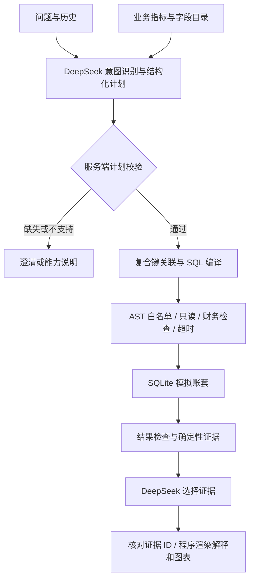

# 问数 v1.1 · SAP 风格财务问答 Demo

基于虚构企业账套的应收与回款分析。DeepSeek 将自然语言转换为受约束查询计划，程序解析 SAP 风格字段、编译 SQL、执行财务检查，并生成带证据的业务回答。

**交付状态：代码、模拟数据和文档已完成。2026-09-23 已完成真实 DeepSeek 最小链路测试；完整黄金集、浏览器、并发和权限测试仍待执行。详见 [测试结果](docs/TEST_RESULTS.md)。**

## 启动

要求 Python 3.10+。本目录与初版独立，无需 Node，无需安装 SAP 或 HANA。

Windows：在此目录打开终端：

```powershell
.\setup.bat
.\start.bat
```

Linux / macOS：

```sh
sh setup.sh
sh start.sh
```

打开 <http://127.0.0.1:8111>。API 文档为 <http://127.0.0.1:8111/api/docs>。

`setup` 创建本目录虚拟环境、安装依赖、首次生成数据；不运行测试。`start` 优先使用本目录虚拟环境，其次使用上级项目虚拟环境。依赖未安装时先执行 setup。数据已存在则不会覆盖。关闭服务后可显式重建：

```powershell
.\.venv\Scripts\python.exe scripts\generate_data.py --force
```

端口冲突时手动启动：

```powershell
.\.venv\Scripts\python.exe -m uvicorn app.main:app --host 127.0.0.1 --port 8112
```

## DeepSeek 配置

配置优先级：进程环境变量 → `v1.1/.env` → 上级 `.env` → 上级 `backend/.env`。已存在环境配置可直接使用，不复制密钥。修改后重启服务。

```dotenv
LLM_BASE_URL=https://api.deepseek.com
LLM_API_KEY=填入你的密钥
LLM_MODEL=deepseek-chat
LLM_TIMEOUT=60
LLM_MAX_RETRIES=2
```

模型名优先继承环境，请以你的账户可用模型为准。`DEEPSEEK_API_KEY` 也可作为密钥备用变量。API 使用 OpenAI 兼容的 `/chat/completions` 与 JSON 对象响应。

页面显示“已配置”只代表发现了密钥，不代表连接已验证。v1.1 的唯一查询入口是 DeepSeek 自然语言问答；没有有效密钥时会明确返回配置错误，不会降级为旧版回放或无模型查询。

服务默认只监听本机，无企业登录或多用户身份体系。`FIN_ALLOWED_COMPANIES=1000,2000` 为服务端固定演示范围，客户端不能扩大；这不是生产租户隔离机制。

## 可以问什么

- 截至2026年6月30日，人民币应收余额最多的前十个客户。
- 截至2026年6月30日，华东公司（1000）逾期超过30天的应收有多少？
- 截至2026年6月30日，人民币应收账龄分布。
- 2026年1月至6月，每月人民币回款是多少？
- 2026年6月30日的余额与5月31日相比，哪些客户增量最大？
- 应收余额的计算口径是什么？

支持澄清后的续问与“换成公司2000”等上下文查询。浏览器内存保留最近12条对话消息，刷新后不保留。不记录或传输模型密钥到浏览器。

固定演示日期为 **2026-07-01**，数据截止 **2026-06-30**。因此“上月”指2026年6月，“本月”超出覆盖范围，需要澄清。默认全部授权公司、CNY 凭证币，结果面板披露实际执行口径。

未覆盖：收入确认、利润、完整现金流量表、预测、因果归因、写入业务系统、跨币种合并。一次请求支持一个指标。可以做余额差额及客户分解，不能凭这些数据断言客户不付款的原因。

## 架构



正常自然语言查询采用两次模型调用：一次识别意图并生成计划，一次选择解释证据。计划 Schema 出错最多修正一次；瞬时网络错误按配置最多尝试三次。查询与会计规则不由模型修改。v1.1 不提供无模型的结构化查询入口。

解释采用受控表达：模型选择已计算事实，程序生成包含金额、时间、单位和维度的句子。证据选择失败则明确降级为程序解释。**Grounding 通过只证明表达与计算证据一致，不证明最初的用户意图已被正确理解。** 用户可查看完整计划核对口径。

前 N 名的总体合计由窗口函数在截断前计算，不能将已显示行加总后冒充总体。余额变化率由 Decimal 计算，比较期为零时为空。

## 模拟数据

默认种子 `20260923`，2个公司、50个客户、1,100张随机应收发票及3张固定发票，再生成回款与贷项凭证。每张凭证两条会计分录，规模为数千凭证/明细，实际行数写入生成后的 `data/manifest.json`。

| 物理对象 | 说明 |
|---|---|
| T001 | 公司代码及本位币 |
| KNA1 / KNB1 | 客户一般信息及公司代码扩展 |
| BKPF / BSEG | 会计凭证抬头及明细，含客户端、公司、年度与凭证复合键 |
| ZAR_APPLICATION | 明确标记为 Demo 自定义的逐笔核销事件 |
| ZDEMO_META | 数据集版本、种子、时间信息 |

使用常见 SAP FI 命名，**不是完整 S/4HANA 复制，也没有实现 ACDOCA Universal Journal**。实际 S/4HANA 项目应优先评估已发布 CDS/OData/API，并结合具体版本、凭证类型配置、付款条件及业务过程确定口径。

为了可重现与精确求和，`WRBTR / DMBTR / AMOUNT` 存为整数分；真实 SAP 通常使用金额类型及币种精度配置。日期存 ISO 文本。付款条件简化为基准日加固定天数，不实现现金折扣、多段付款或复杂工厂日历。USD 本位币仅以固定演示汇率7生成平衡分录；问答只统计选定凭证币，不提供汇率换算。

所有客户贷方收款/贷项均分配到发票。回款仅取 DZ，DG 贷项不是现金流。当前清账日期可展示但历史余额按逐笔事件重建。未覆盖未分配收款、剩余项目、撤销清账、汇兑损益、税额拆分或法定报表完整性。

生成器同时输出 `control_totals.json`：根据生成中的业务事件独立计算多个时点的总额，作为用户验收的参考。这些参考值未经过本轮测试验证，也不能替代固定样例的人工核算。

## 目录

```text
v1.1/
  app/                  配置、计划、编译器、执行器、财务检查、证据、API
  data/semantic.json    指标、字段、复合关联与业务约定
  scripts/             数据构建脚本
  web/                 无构建依赖的前端源码
  docs/
    IMPLEMENTATION_PLAN.md
    TEST_PLAN.md
    V1_2_ROADMAP.md
  setup.bat / setup.sh
  start.bat / start.sh
```

## 验收与下一版本

- [测试计划](docs/TEST_PLAN.md)：用户自行执行，包含固定财务样例、API、模型、交互及异常场景。
- [测试结果](docs/TEST_RESULTS.md)：当前真实 DeepSeek 验收记录与未完成项目。
- [v1.2 完整版构建思路](docs/V1_2_ROADMAP.md)：企业级能力拆分、模块契约、交付顺序与验收门槛。
- [v1.1 实施记录](docs/IMPLEMENTATION_PLAN.md)。

不继承初版 README 的任何测试通过率或测评结论。当前没有本版本的测试结果。

## 后续 Git

本轮未提交或推送。`.env`、虚拟环境、生成的数据库及控制总额被本目录 `.gitignore` 忽略；保留生成器、语义配置、页面和文档即可重建。用户完成测试后，可在仓库根目录检查并提交 `v1.1/`。不要提交密钥或误用初版测评结果作为新版结果。

