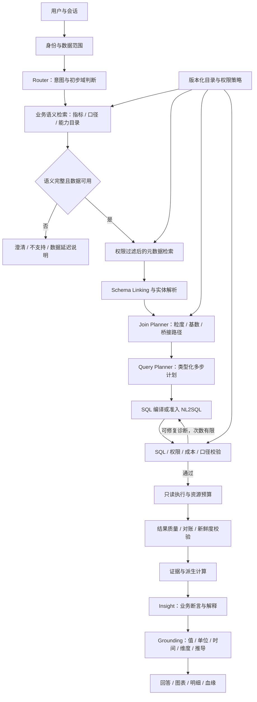

# v1.2 完整版构建思路与分阶段计划

本文件是后续构建方案，**不是已经实现的能力清单**。v1.1 是可核对的小型财务 Demo；v1.2 的目标是建立可接入真实企业数据、可扩展业务域、可治理指标且可追溯问答的系统。企业级能力必须通过真实数据、权限和运行环境验证，不能仅靠增加模块名称宣称完成。

## 1. 目标与边界

第一条真实业务链继续选择财务应收与回款，先获得一个明确SAP版本、公司范围、账套和数据接口的试点。平台支持注册更多业务域，但正式接入销售、采购或库存要分别交付领域语义包和验收集。

v1.2应达到：

1. 业务人员使用中文提出问题，系统能澄清日期、会计口径、法人、客户和币种。
2. 可在大元数据目录中检索相关表/视图，保留指标依据、必要桥接关系与来源版本。
3. 用户权限贯穿检索、规划、执行、解释、导出、缓存和审计。
4. 固定指标用确定性编译；经过准入的探索问题可走受限NL2SQL，始终执行同一套校验与预算。
5. 答案中的原始数字和派生计算均能追溯到执行记录、业务定义版本及数据快照。
6. 可观测查询成功率、口径错误率、澄清率、成本、延迟及数据新鲜度。

首个企业试点仍不自动承担税务申报、审计签字、支付、记账等业务写操作。完整财务域的利润/收入/现金流指标是后续领域包，需财务负责人确认，不从应收余额推断生成。

## 2. 相对 v1.1 的升级

| 能力 | v1.1 | v1.2 |
|---|---|---|
| 数据 | 虚构SQLite账套 | 源系统适配、快照/增量同步、质量与新鲜度 |
| SAP语义 | FI字段风格简化表 | 与具体SAP版本匹配的业务接口与财务口径 |
| 业务域 | 固定应收与回款 | 领域注册机制，财务先落地 |
| 业务目录 | 本地JSON | 可版本化、审批、回滚的指标与实体目录 |
| 元数据 | 固定小目录 | 授权过滤、混合检索、重排与桥接关系补全 |
| 关联 | 固定复合键 | 受治理的关联图、粒度与基数约束 |
| 查询 | 固定计划编译 | 编译优先，准入探索SQL；多步骤查询计划 |
| 权限 | 固定公司范围 | SSO、服务端策略、行列级权限和源端最小权限 |
| 解释 | 模型选择证据、受控句式 | 类型化业务断言、程序计算、受控自由表达与校验 |
| 部署 | 本地单进程 | 模块化服务、后台作业、队列、资源预算与运行观测 |
| 验收 | 待执行Demo测试计划 | 真实口径金标准、权限/安全/回归/性能发布门槛 |

## 3. 总体架构



保留最初12个逻辑职责，但不将每个方框都做成Agent或网络服务。第一阶段采用模块化单体：API、应用编排、语义/目录、规划、执行、证据、治理模块。耗时同步/检索索引构建和查询执行逐步移到工作进程。

权限、日志、运行预算、会话状态、语义版本和数据快照是横贯链路的约束，不只在SQL执行前检查一次。

## 4. 推荐技术与部署路径

- 后端保留 Python、FastAPI、Pydantic；将配置、契约、领域规则做成独立包。
- 元数据、会话、语义版本和审计索引用 PostgreSQL；开始时采用其全文检索与 pgvector，避免初期同时维护多种搜索基础设施。
- 中文业务词采用规范化、同义词词典、字符/词组检索与向量召回组合。不能假设数据库默认分词能正确处理SAP缩写或中文简称。
- 检索向量需要独立Embedding接口或本地Embedding模型。现有DeepSeek聊天API不能默认当作Embedding服务；根据部署和数据出境约束单独选型。
- 大对象证据与结果快照存放对象存储，数据库只存引用、校验和与保留策略。
- 初期使用关系表存Join Graph，程序做受限路径搜索；只有多域规模与查询需求证明必要时再考虑图数据库。
- 执行器按数据库方言实现适配，sqlglot负责解析与规范化；成本估算、超时和取消必须使用源数据库能力。
- 作业达到并发需求后引入Redis与任务队列；缓存键包含权限指纹、语义版本、参数和数据快照版本。
- 前端升级为React/TypeScript，保留“口径可見、结果可核对”的工作台结构，不把内部编排术语放到普通查询流程中。
- DeepSeek接口封装为可替换Provider，记录实际模型名、提示版本、token数和请求时延，不在业务代码中散落直接HTTP调用。

## 5. 真实 SAP 数据接入

### 5.1 先确认系统事实

对每个数据源记录：ECC/S/4HANA版本、部署方式、可用CDS/OData/API、授权机制、会计年度变式、公司/凭证类型配置、币种精度、付款条件、特殊总账标识及数据刷新频率。

S/4HANA 可涉及 ACDOCA、BKPF/BSEG 及相应业务视图，具体语义和访问方式随版本而异。优先使用已发布业务接口或经过批准的报表副本；不承诺一组原生表名适用于所有企业。

### 5.2 接入产物

每个适配器提供：

- `SourceDescriptor`：源标识、方言、版本、时区、权限方式和新鲜度。
- `discover_metadata()`：表/视图、列类型、说明、复合键、关系、统计信息及版本。
- `fetch_snapshot(watermark)`：可重跑且幂等的快照/增量导入，支持更正、撤销和迟到数据。
- `execute_readonly(query, bindings, budget)`：仅允许经过校验的查询，支持取消及执行统计。
- 财务对账报告：与企业认可的应收报表，在同口径同截止日逐公司/币种核对。

### 5.3 规范业务层

建立标准实体：`AccountingDocument`、`CustomerLineItem`、`SettlementEvent`、`PaymentTerm`、`BusinessPartner`、`CurrencyDefinition`。

企业接入时将真实数据映射到这些实体。v1.1 的 `ZAR_APPLICATION` 只是演示事件源；企业侧必须依据真实清账、部分付款、剩余项目、撤销与重清账流程实现适配，不能假定生产SAP有同名表。

日期至少区分业务发生日、凭证日、过账日、到期日、核销生效日和数据获知时间。需要复现“当时系统知道什么”时，使用业务有效时间与系统记录时间两套时间；仅保存当前状态无法可靠重建历史。

## 6. 业务语义模型与治理

每个指标必须注册以下字段：

| 字段 | 作用 |
|---|---|
| metric_id / version / domain | 稳定标识及版本 |
| business_name / synonyms | 业务名称与表达 |
| description / owner / approval_state | 定义、负责人及审批状态 |
| grain / dimensions | 数据粒度与允许维度 |
| expression / aggregation | 计算表达式、可加性、聚合方式 |
| time_role / calendar | 时间字段和会计日历 |
| currency_policy / unit | 币种、汇率、单位及精度 |
| source_bindings / joins | 物理字段和合法关联 |
| exclusions / data_requirements | 排除范围、数据条件 |
| effective_from / effective_to | 生效区间 |
| quality_rules / gold_cases | 质量规则与口径验收样例 |
| sensitivity / policy_tags | 数据敏感级别及权限标签 |

指标表达式采用可解析的受限表达式树，禁止把任意Python或任意SQL文本直接视为可信业务定义。维护流程为草稿→财务审核→数据负责人验证→发布；发布版本不可原地修改，支持回滚。

客户实体需要企业内唯一标识、源系统标识、历史名称、别名和有效期。模糊匹配得到多个候选时澄清；置信度不能单靠模型自报。

## 7. 检索、字段绑定与关联规划

检索顺序：

1. 根据用户身份过滤可见领域、指标和表列，禁止先检索所有信息后在答案中隐藏。
2. 用业务定义识别候选指标与实体；缺口径先澄清。
3. 在目标域内进行关键词/同义词/向量混合检索；以指标绑定的已确认数据源优先。
4. 重排候选，记录召回依据、版本和来源。
5. 扩展必要维表和桥接关系，保留复合主键及必要日期/币种字段。
6. 在上下文预算内选择字段，不固定死“最多20张表”；超预算或多条无法区分的路径应拆分查询或澄清。

Join Planner 的关系边包含关联键、基数、有效期条件、来源可信度、基准粒度以及是否允许双向遍历。外键、数据统计与人工确认形成证据；模型推断只作为待审建议。

面对两个事实表时优先分别聚合到共同粒度再连接。路径最短不一定正确；必须限制多对多扩张、金额重复、慢变维多版本匹配和多源实体歧义。

## 8. 计划契约与SQL路线

建立版本化 `QueryIntent → LogicalPlan → PhysicalPlan → ExecutionResult` 契约。

```json
{
  "schema_version": "1.2",
  "intent_id": "generated-request-id",
  "domain": "finance.ar",
  "metric_refs": [{"id": "ar_balance", "version": "2026.1"}],
  "dimensions": ["customer"],
  "filters": [{"field": "company", "operator": "in", "value": ["1000"]}],
  "time": {"role": "as_of", "value": "2026-06-30"},
  "currency": {"mode": "transaction", "code": "CNY"},
  "comparison": null,
  "sort": [{"field": "ar_balance", "direction": "desc"}],
  "limit": 10
}
```

用户可以表达公司过滤，但权限上下文由服务端附加，模型无法提交或覆盖 `tenant_id`、`principal_id`、权限指纹或数据源凭证。

规划节点包括过滤、时点重建、聚合、受控关联、比较、排名及派生计算。一个问题需要多个查询时，记录依赖、共享快照和各节点预算，避免串行调用结果来自不同时间点。

SQL路线：

- 已注册财务指标默认编译器路线，保留v1.1的确定性优势。
- 探索路线只允许授权视图、字段和已确认Join路径；模型看到裁剪后的Schema与计划，不接触数据库凭证。
- 校验包含AST、真实Schema、列血缘、函数白名单、策略注入/复核、Join基数、聚合粒度、币种和EXPLAIN预算。
- 修复最多两轮，只给结构化错误与允许上下文。缺业务口径、缺权限、无可信关联不可进入无限修复。
- 外部文件函数、网络访问、扩展加载、系统目录、写入/DDL等由数据库权限与执行器共同限制。

## 9. 结果验证、解释与证据

结果校验分三层：类型/精度/单位；业务不变量与对账；数据新鲜度和异常提示。统计异常只标记待解释，不能把业务上合理的大额变化自动判错或删掉。

`EvidenceBundle` 至少记录查询ID、身份范围摘要、计划、指标版本、SQL与参数引用、源快照、水位、执行时间、列类型、结果摘要和校验结论。敏感参数与结果遵从权限与保留策略，不直接写入普通日志。

派生数值以 `DerivedFact` 保存：输入证据引用、确定性公式、Decimal精度与舍入策略。同比/环比要校验分母、完整期间、日历可比性和数据缺口。

解释模型先生成类型化断言：

- `value`：某范围某指标的值。
- `comparison`：同口径的差额或比率。
- `contribution`：确定性差额分解。
- `hypothesis`：有明确标签、不能冒充事实的待验证解释；首个生产试点可关闭。

程序验证断言中的指标、维度、时间、单位、值和计算来源。自由文案只对已通过断言进行表述，不能添加新的数字或因果事实。无法核验时降级受控模板；核验失败严重时只返回结果表和问题说明。

## 10. 权限、执行与运行治理

- 使用企业SSO/OIDC，服务端确定用户与租户，映射公司、组织、客户及列权限。
- 检索索引带权限标签；跨租户索引隔离，授权变化能使缓存失效。
- 数据库使用最小权限只读账号，敏感列脱敏，必要时源端RLS或安全视图作为最终边界。
- 每次执行具有扫描量、返回行数、时长、并发和费用预算；全局取消能中止数据库与后续模型工作。
- 大结果下载走独立授权导出作业，不能通过聊天结果上限绕过权限。
- 记录阶段耗时、错误类别、模型token、重试、拒答与澄清原因；不保存思维链。
- 提示/语义/Schema/模型/策略变更均关联版本；上线前回放固定验收集。
- 数据权限与脱敏完成后再发送模型；明确哪些元数据或结果允许发送外部API，支持Provider替换。

## 11. 目录与模块演进

在后续独立 `v1.2/` 中建议采用：

```text
backend/
  api/                 身份、会话、问答、治理与导出接口
  contracts/           Intent/Plan/Policy/Evidence版本化模型
  orchestrator/        状态机、预算、取消、重试
  domains/finance_ar/  指标、日期、币种、实体与业务规则
  catalog/             元数据、语义版本、索引、审批
  retrieval/           混合检索与重排
  planning/            字段绑定、关联图、逻辑/物理计划
  execution/           编译器、SQL校验、驱动、成本预算
  evidence/            派生计算、断言、Grounding
  governance/          权限、审计、新鲜度、质量
  providers/           DeepSeek及Embedding适配
connectors/            SAP/报表副本/模拟源适配器
frontend/              业务工作台与管理员目录页面
evaluation/            真实口径金标准、检索/计划/执行/解释评估
infra/                 开发部署、迁移、监控配置
docs/                  数据契约、指标说明、运行与恢复手册
```

模块化单体先行，只有执行/索引等有独立扩缩容需求时再拆服务。保持同一查询ID贯穿各阶段。

## 12. 交付顺序与验收门槛

以下是构建顺序和出口条件，工期取决于真实SAP接口与业务口径准备度，不给脱离条件的日期承诺。

| 阶段 | 具体工作 | 交付物 | 出口条件 |
|---|---|---|---|
| A：v1.1基线 | 执行当前测试计划、修复缺陷、冻结金标准 | 测试报告、数据/语义版本、失败题归档 | 固定金额零误差；已知越范围问题关闭 |
| B：契约与可观测性 | 提取Plan/Policy/Evidence契约；加入查询ID、阶段耗时与取消 | 模块化骨架、版本化接口、运行追踪 | v1.1金标准通过新链路，接口错误可定位 |
| C：真实源试点 | 选一个SAP系统和公司账套，完成快照/增量、撤销处理和时间语义 | 源适配器、映射表、对账报告 | 同一截止日与指定SAP报表逐公司/币种对账；差异解释获认可 |
| D：目录治理 | 发布指标版本、审批、实体别名、元数据增量同步 | 语义管理页、Schema快照、回滚流程 | 旧查询可按原版本复现；未知字段变更使计划失效而非静默改算 |
| E：检索与Join | 权限过滤、混合召回、字段链接、桥接路径和粒度检查 | 检索基准、关联图、候选解释 | 必需表字段及桥接路径可召回；多对多陷阱用例被拦截 |
| F：计划与执行 | 多步骤IR、方言编译、受限NL2SQL、EXPLAIN预算、源端取消 | 查询执行服务、探索路线开关 | 不支持问题不硬查；修复有上限；执行预算可中断 |
| G：企业权限 | SSO、行列策略、检索与缓存隔离、授权导出 | 权限矩阵、审计与隔离报告 | 跨公司/跨租户/敏感列用例全部通过；无共享缓存泄露 |
| H：证据与解释 | 版本化证据、派生公式、类型化断言、受控自由表达 | 可追溯答案、核验报告、降级机制 | 所有金额可回溯；错误断言不能进入最终答案 |
| I：运营与扩域 | 并发/成本/恢复演练，新增第二个业务领域包 | 试点运行手册、第二域验收集 | 达成实测SLO；新领域通过独立语义和权限验收 |

身份和权限契约在B阶段确定，开发环境可用测试身份；接入真实敏感数据前必须具备相应访问控制，不能等G阶段完成后再补数据保护。G阶段完成整个链路的企业级隔离验证。

## 13. 评估方案

不要只比较最终SQL是否和参考SQL字符串相同。分层记录：

| 层 | 指标 |
|---|---|
| 意图与语义 | 指标/口径/时间/实体识别准确率，正确澄清率、误拒率 |
| 检索 | 必需表列召回率、桥接路径召回率、上下文大小与时延 |
| 关联规划 | 粒度正确率、基数陷阱拦截率、重复累计错误数 |
| 查询结果 | 同口径结果一致率、金额误差、执行失败和修复次数 |
| 权限 | 越范围阻断率、列泄露、缓存/导出/索引泄露 |
| 解释 | 断言核验通过率、无证据断言率、分母及单位错误 |
| 用户体验 | 可答覆盖率、澄清轮数、端到端时延、失败恢复 |
| 运行成本 | 每次请求token/API费用、扫描量、并发、缓存命中 |

验收集包含用户真实问法、SAP缩写、模糊客户名、迟到凭证、撤销清账、部分付款、多币种、跨年度、会计期间、截断与空结果。开发集和验收集分开，不把参考答案直接作为模型检索样例。

扩大元数据规模时可增加数千张干扰表/视图测试召回，业务事实数据不必同步扩大；数据库性能再使用可控规模单独压测，分别判断两种瓶颈。

初步准入目标：固定口径金标准金额零误差；权限攻击集零泄露；任何最终业务断言都需具备有效证据；明确可答问题端到端正确率目标≥95%，同时公布覆盖率与未答比例。以上是目标，需要真实评测报告支持，不能提前作为产品成绩。

## 14. 主要风险与处理

| 风险 | 处理 |
|---|---|
| 错把SAP字段名理解为稳定业务语义 | 用版本化业务接口、负责人确认与报表对账建立映射 |
| 现有表只有当前状态 | 保存历史事件/快照；无法复原时拒绝历史口径查询 |
| 元数据候选漏掉桥表 | 关系闭包补全、路径召回评估，不机械截断TopK |
| 模型生成合法但错误口径的SQL | 编译优先、类型化计划、指标版本、执行前语义检查 |
| 不同源/期间数据不可比较 | 共享快照、会计日历与新鲜度检查 |
| 错误结果也被成功Grounding | 独立验证业务口径与查询结果，不将引用一致当正确性证明 |
| 复杂度迅速超过Demo维护能力 | 按阶段出口推进，先模块边界后基础设施扩张 |

v1.1可复用的是计划契约、编译/校验分离、历史事件思路、整数精度、证据绑定和固定案例。需要替换的是模拟数据适配、固定身份、小目录检索和受限指标覆盖。完成v1.2后仍应保留v1.1作为小型可重现回归环境。
