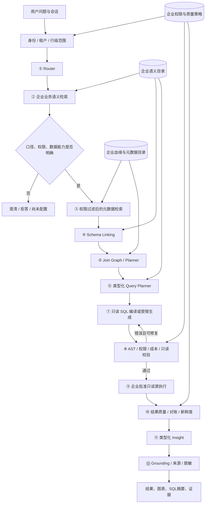

# v1.2 企业只读架构说明

## 1. 目标

系统把自然语言问题转换为一个经过企业配置约束的只读查询，并返回带来源的业务解释。可靠性来自企业确认的业务事实、确定性规则和模型受限编排，不来自模型自行猜测企业规则。

## 2. 端到端流程

每个阶段都有 `passed`、`needs_clarification`、`unsupported`、`blocked_by_policy` 四种结果。失败不会被下一阶段当成成功上下文继续使用。

## 3. 阶段契约

### ① Router

输入用户问题、会话、身份范围和企业支持域目录；输出业务域候选、问题类型、缺失信息和置信原因。企业提供业务域名称、组织简称、常见问题、禁止问题和必须人工确认的问题。Router 只能提出候选，不能把猜中的业务域当成权限授权。

### ② Business Semantic

输入企业指标目录、术语表、历史别名、时间日历和币种政策；输出指标候选、口径差异和澄清问题。企业提供指标名称、定义、粒度、公式、可加性、时间角色、币种、排除项、负责人和生效版本。

比如“销售额”在不同企业可能指订单金额、开票金额或确认收入。没有企业批准定义时必须澄清，不能用通用常识替代。

### ③ Metadata Retrieval

输入已确认的指标候选、实体、权限标签和企业目录；输出候选表/视图、字段、血缘路径、数据版本和召回理由。企业提供的血缘关系查询表或治理平台输出是权威来源之一。DB catalog、CDS 元数据和人工映射必须标明来源和可信等级，与权威输入冲突时进入人工处理。

### ④ Schema Linking

企业必须确认 SAP 版本/视图、字段意义、前导零、状态码、借贷标识、币种和复合键。模型只能排序候选，不能发布新的字段映射。

### ⑤ Join Graph / Planner

企业必须确认一对一、一对多、多对多、桥表、历史有效期和禁止关联。两个事实表不能因为字段名相同就直接连接；需要先聚合到共同粒度或得到企业批准的桥接规则。

### ⑥–⑨ 查询与执行

注册指标优先由程序编译。探索性问题只能使用企业批准的只读视图和目录对象。企业提供数据库方言、只读账号/接口、允许视图、扫描/时长预算、并发限制和数据刷新水位。应用和数据库共同拒绝写操作、外部函数、文件访问和网络访问。

### ⑩ 结果质量

系统检查类型、单位、币种、空值、重复累计、异常行数、数据新鲜度和企业对账规则。企业提供标准报表、容差、质量阈值和异常处理方式。

### ⑪–⑫ 解释与 Grounding

结果先转换为类型化事实，再由模板或模型组织语言。每个金额、日期、比例和比较都引用结果字段、公式和查询快照。企业提供语言风格、敏感信息遮蔽和禁止推断规则。没有相应企业数据和批准规则时，不得推断客户流失原因等因果结论。

## 4. 三道只读边界

1. 应用边界：接口只接受问题和结构化计划，不接受任意写 SQL。
2. 数据库边界：使用只读账号、安全视图、RLS/CLS，禁用写权限和外部函数。
3. 网络边界：执行服务只能访问批准的数据源和模型网关。

应用代码中的“只生成 SELECT”不能单独作为只读证明，三道边界必须由企业基础设施验证。

## 5. 架构交付

试点交付包括架构图、企业输入契约、语义版本、血缘快照、权限矩阵、只读连接规范、查询样例、验收报告、运行手册和已知限制。是否由平台团队在企业内部部署，不影响架构交付的完整性。
